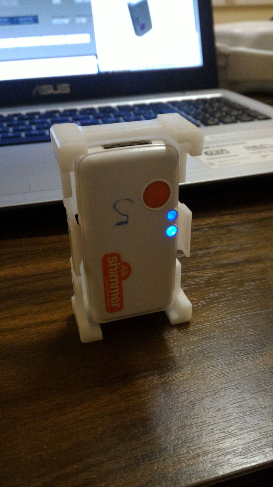

# Tutoriel accéléromètres

NB : Ce tutoriel sert à l'utilisation du shimmer3, les autres versions ne seront pas adaptées. 

Pour pouvoir utiliser les accéléromètres, vous devez avoir installé le programme *Consensys* sur votre ordinateur (disponible pour téléchargement [ici](http://www.shimmersensing.com/support/wireless-sensor-networks-download/). 

Branchez le cable de la base à une prise et ensuite branchez le cable à la base (suivez bien cette ordre). 
Pour allumer un des accéléromètres, appuyez sur le boutton orange. Le led 

## Calibration

Téléchargez le programme *shimmer 9DOF calibration*. La dernière version est disponible sur le site [Shimmer Sensor](http://www.shimmersensing.com/products/shimmer-9dof-calibration#download-tab). Un document sur la calibration (en anglais) est aussi disponible pour téléchargement. 

Il est recommandé d'aussi suivre le [vidéo](https://www.youtube.com/watch?v=aI2WDecTtfs) avec la démonstration de la calibration pour mieux suivre ce tutoriel.

**La calibration doit être faite pour chaque capteur séparamment.**

Avec le programme *shimmer 9DOF calibration* installé, allumez le Bluetooth de votre ordinateur et connectez-le au capteur que vous irez calibrer (PIN : 1234). Il faut que le capteur soit allumé pour pouvoir le connecter. Vous devez laisser le capteur connecté à votre ordianteur pendant tout le processus de calibration. 
Le capteur doit apparaître dans "Appareils bluetooth disponibles" comme "Shimmer3-XXXX" (ou XXXX sera l'ID de votre capteur, par exemple "Shimmer3-8D77"). 

Posez le capteur sur le "*Shimmer3 Calibration Stand*".

Ouvrez le programme *shimmer 9DOF calibration*. Selectionnez l'ID du capteur et cliquez sur "**Connect**"

Il va apparaître "Shimmer Connected" sur "Application State" si la connection est réussite. 

Pour calibrer, il faut définir les axes du capteur. Dans notre cas, nous utiliserons la convention de l'image ci-dessous. 

### Calibration du accéléromètre

Vous pouvez choisir le type d'accélération et la gamme d'accélération (cela va dependre de l'application envisagée pour l'accéléromètre). Dans ce tutoriel, on choisit "Low noise" et "2.0g".

Pour commencer la calibration, vous devez choisir une surface planne. Cliquez sur **START** (en vert) pour lancer le transfert de données du shimmer vers l'ordinateur. Placez votre axe x vers le haut. 

Appuyez sur **X+g** et attendez jusqu'à que le "**wait**" disparaît. 

Tournez le shimmer de façon a placer l'axe x vers le bas. Appuyez sur **X-g** et attendez jusqu'à que le "**wait**" disparaît.

Positionnez l'axe y vers le haut. Appuyez dur "**Y+g**" et attendez jusqu'à que le "**wait**" disparaît.

Tournez le shimmer de façon a placer l'axe y vers le bas. Appuyez sur **Y-g** et attendez jusqu'à que le "**wait**" disparaît.

Positionnez l'axe z vers le haut. Appuyez dur "**Z+g**" et attendez jusqu'à que le "**wait**" disparaît.

Tournez le shimmer de façon a placer l'axe z vers le bas. Appuyez sur **Z-g** et attendez jusqu'à que le "**wait**" disparaît.

Vous pouvez répeter autant de fois que vous voulez chaque axe. Après avoir suivi cette méthode pour les trois axes, cliquez sur "**STOP**" (en rouge). 

Normallement vous devez obtenir un tableau comme celui-ci :

Si le tableau en en bleu, la calibration n'a pas encore été transmise au shimmer. Il faut donc appuyer sur "**Save ACCEL to Shimmer**". Vous pouvez aussi enregistrer votre calibration sur votre ordinateur en cliquant sur "**Save ACCEL to file**" (il est recommandé de le faire au cas où la calibration est perdue due à un imprévu).

Après avoir appuyé sur "Save ACCEL to Shimmer" le tableau doit être gris. 

### Calibration du gyroscope

Sélectionnez l'onglet "Gyroscope". 

Vous pouvez aussi sélectionner la gamme du gyroscope selon votre application. 

Cliquez sur **START**. 

Posez le shimmer sur une superfice planne. Cliquez sur **stationnaire**. Ne touchez pas au shimmer ni à la surface, il ne doit avoir aucun mouvement ni vibration. Attendez jusqu'à la disparition du **wait**. 

foto 7 do bala

Maintenant on va commencer à rotationner le shimmer. 

Il est recommandé d'utiliser un objet ou une surface de réference pour appuyer le shimmer pendant la calibration. 

Pour l'axe x, vous devez faire attention de tourner le shimmer dans le sens de l'horloge, avec l'axe x qui est directionné vers l'horloge. 

*botar imagem do eixo x entrando no rélogio

Avant commencer la rotation, cliquez sur "**Rotation X**". Vous devez faire une rotation complète (360 degrés) en vous garantissant de placer le shimmer exactement dans la même position du début. Pour cela, vous pouvez l'appuyer sur la surface de référence de façon à simplifier le travail. Vous pouvez déplacer linéairement le shimmer, mais vous ne devez pas le tourner dans les autres axes. 

Pour mieux expliquer comment faire la rotation du shimmer, un [vidéo démonstratif]() est disponible. 

Après rotationner le shimmer, cliquez sur **Press to Stop**.

Vous devez répeter la rotation pour les trois axes. Vous pouvez réaliser les rotation dans l'ordre que vous souhaitiez et autant de fois vous trouvez pertinent. 

Cliquez sur **STOP** en rouge pour arreter la transmission de données. 

Après avoir fait la rotation pour les trois axes, cliquez sur "**Save GIRO to Shimmer**" pour envoyer la calibration du gyroscope vers le shimmer. Le tableau de paramètres de calibration doit passer de bleu à gris. 
De plus, si vous voulez enregistrer la calibration sur votre ordinateur, cliquez sur "**Save GIRO to file**".

### Calibration du magnetomètre 

Sélectionnez l'onglet "Magnetometer". 

Vous pouvez aussi sélectionner la gamme du magnetomètre selon votre application. 

Cliquez sur **START**. Cliquez sur **Rotation XYZ**. 

Tournez le shimmer aléatoirement dans toutes les directions possibles. Vous devez obtenir progressivement dans les trois graphiques qui apparaîsent quelque chose qui ressemble de plus en plus à une sphère. Vous pouvez vous arreter quand les trois graphiques semblent beaucoup à un sphère (cf. images ci-dessous). 

*botar muitas imagens aqui*

Quand vous trouvez que la calibration est suffisante, appuyez sur **Press to Stop**. 

Cliquez sur **STOP**. 

Pour vérifier la calibration, changez le "**Magnetometer format**" de **Uncalibrated** par **Calibrated**. Si la calibration est bonnne, les graphiques doivent être des cercles presque parfaits centrés en (0,0,0). 

colocar imagem aqui

## Utilisation

